[//]: # (LSTM-RNN Assisted)
# Cryptocurrency Trading Bot 
[](https://www.python.org/downloads/release/python-370/)
[]()
[]()
> A strategy and system for automated trading of cryptocurrencies. <br/>
> Jump to: [Strategy Performance](#Strategy-Performance)

<br/>
<p align="left">

## Table of Contents

- [General Info](#general-information) <br/>
- [Technologies Used](#technologies-used) <br/>
- [Data Used](#Data) <br/>
- [Neural Network](#Neural-Network) <br/>
- [Strategy](#Strategy)<br/>
- [Contact](#contact)

</p> 
<br/>

## General Information
This repository contains the summary of the development of an automated trading system for cryptocurrencies.
The purpose of this work is to deploy a working, profitable trading system. This presentation highlights the 
design, backtest, live test and live deployment of the system.

The strategy developed is classed as a day-trading scalping strategy where the aim is to generate small positive
returns frequently over a large number of orders and trades.

The strategy is based in part on the output of an LSTM-RNN, that is a recurrent neural network based on interconnected 
Long Short Term Memory nodes. The development and implementation of the neural network is also briefly presented here.

The sample code provided in this repository is a simplified version of the source code developed and is not intended to 
be used directly. The current stage of development includes backtesting the strategy on the Bitcoin-Tether (BTC-USDT) 
pair, on historical data from 01-2021. Results are presented in the following sections.

<br/>

## Technologies Used
### Backtesting
For testing the strategy on historical data with tools optimised for faster calculations on datasets. For example OHLC 
charts on minute intervals over months and years.

| Language    | Databases                       | Data Manipulation | Technical Analysis         | Data Visualisation | Neural Networks                      | Backtesting Framework |
|-------------|---------------------------------|-------------------|----------------------------|--------------------|--------------------------------------|-----------------------|
| Python 3.7  | Binance <br/> SQLite<br/> CSVs  | Pandas            | TA-Lib<br/>NumPy<br/>SciPy | Matplotlib         | CUDA<br/>Scikit-Learn<br/>TensorFlow | Backtrader            |

### Live Testing
For validating the strategy on unknown future data with normal trading conditions. The technologies above-mentioned 
apply plus the following.

| Exchange                    | Server  | Application <br/>Environment  | GUI <br/>Framework                   |
|-----------------------------|---------|-------------------------------|--------------------------------------|
| Binance <br/>(spot Testnet) | AWS EC2 | Docker                        | Dash <br/>(Flask React.js Plotly.js) |

### Trading
Finally, implementing the validated strategy and generating profits (hopefully). The technologies 
above-mentioned apply plus the following.

| Exchange |
|----------|
| Binance  |

<br/>

## Data
### Historical Data
For example, the strategy has been back-tested on the Bitcoin-Tether (BTC-USDT) pair, on historical data from 01-2021. 
The below figures show the close prices on the left, and volumes traded on the right, of BTC-USDT on sub-sampled 1 
minute intervals from 01-2021 to 07-2021. This raw data was sourced from the Binance exchange public historical data.

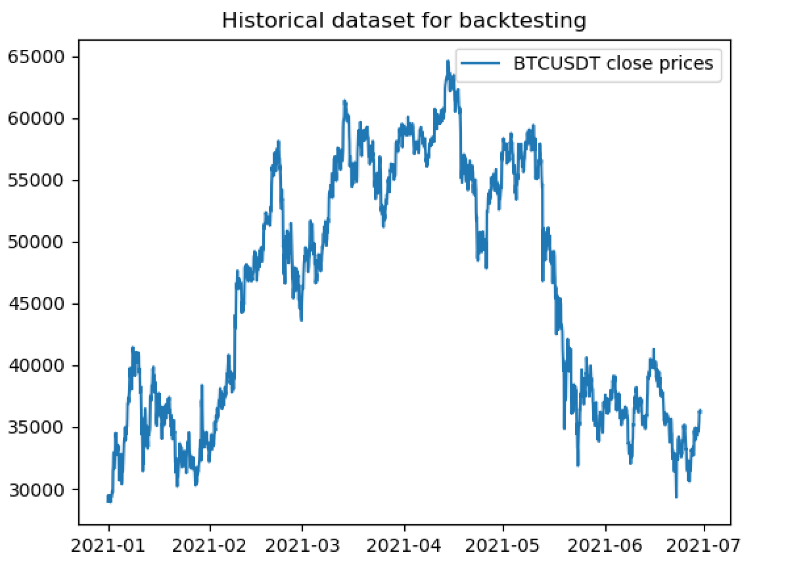 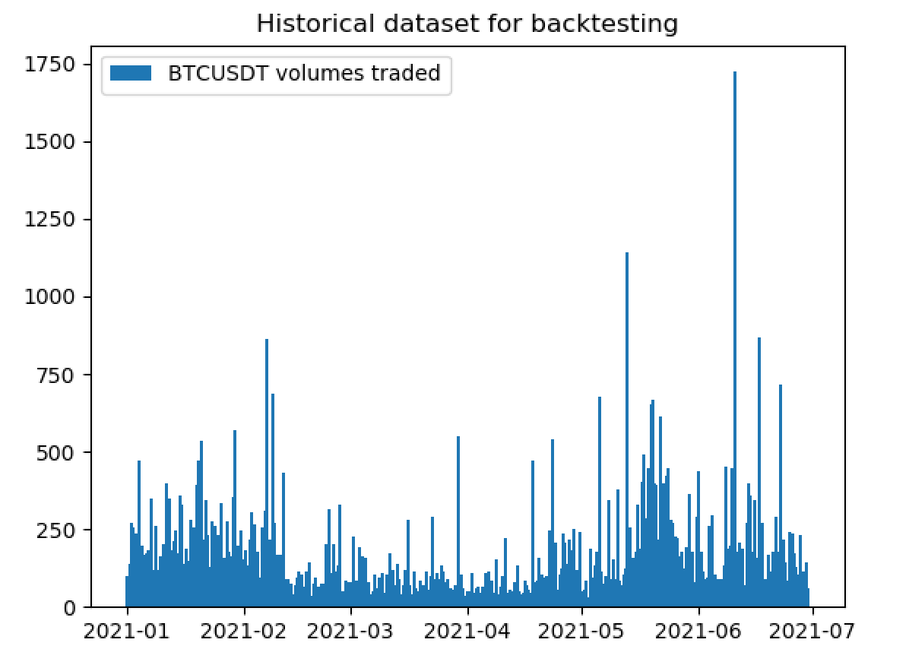

Bitcoin (BTC) often represents general cryptocurrency trends. Trading against the Tether coin (USDT) allows a constant 
relevant value of the portfolio and simplifies calculations while executing the strategy for this example. Some 
exchanges also offer lower commissions for trading between cryptocurrencies rather than with USD. This particular 
timeframe was selected for its volatility and difficulty due to the May 2021 crash. Some key metrics given 
below.
```
Indicators on close price
_________________________________________________________________
 Standard deviation from mean: 21.8 %
 1st percentile of 5min percentage changes : -0.967 %
 99th percentile of 5min percentage changes : 0.985 %
_________________________________________________________________
```
The high volatility of the pair is shown by the standard deviation of the price of Bitcoin against USD, and by 
the values of the price's 5-min percentage changes. The 1st and 99th percentiles of 5 min percentage changes
are around minus and plus 1 percent, meaning that over the 6-month timeframe, around 1 in 100 5-min periods saw a 
1 percent or greater increase or decrease in price.

<br/>

## Neural Network
### Data Selection
A subset of the historical data is used for training and validation of the neural network. In the current example the 
subset used for training is data from the first two weeks of january 2021, that is 01-01-2021 to 14-01-2021. The figures 
below shows the close prices (left) and volumes traded (right) on 10 minute intervals from 01-01-2021 to 14-01-2021.

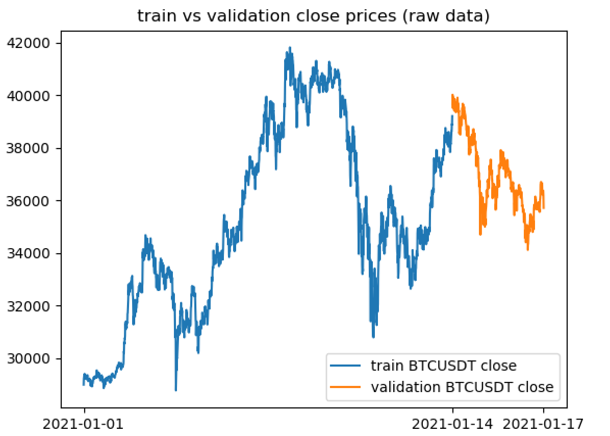 

Logically, this subset was selected at the beginning of the larger dataset, this prevents information leakage from the 
training set to test set when backtesting the strategy on succeeding data from the rest of the dataset.

### Data Processing
To aid the network in learning, input and target values are processed giving the data certain characteristics. In
particular the input and target values of training and validation data have 0 mean and a bounded standard deviation.
The exact processing method is not public. As can be understood from the target values shown, the network is applied 
for regression.
The figure below shows the processed training and validation target values.

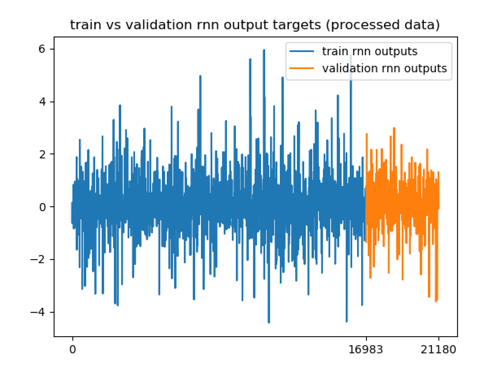

The x axis no longer shows time as the training and validation data is shuffled, the cumulative number of samples is 
displayed instead, there are 19519 training data-points and 4831 validation data-points. The y axis no longer shows
the close price as the data is processed, the processed target values are shown instead.
Data processing was performed in part with stacked transformers and scalers using pipline objects from Scikit-Learn. 

### Network Summary
The network was trained with TensorFlow and CUDA cuDNN. Below is a summary of the trained network architecture.

```
Model: "sequential"
_________________________________________________________________
 Layer (type)                      Output Shape         Param #  
=================================================================
 bidirectional (Bidirectional)     (None, 180, 120)     29760

 bidirectional_1 (Bidirectional)   (None, 60)           36240

 dense (Dense)                     (None, 30)           1830      

 dense_1 (Dense)                   (None, 1)            31        

=================================================================
Total params: 67,861
Trainable params: 67,861
Non-trainable params: 0
_________________________________________________________________
```

As is summarised in the table above, the RNN is composed of stacked recurrent layers and feed-forward layers. There are
2 recurrent layers and 2 feedforward layers. 
The first is the input layer and is composed of 120 bidirectional LSTM nodes, it accepts a sequence length of 180 
samples and returns sequences to the second recurrent layer. The second recurrent layer is composed of 60 LSTM nodes
and does not return sequences. The first feedforward layer is composed of 30 dense nodes. The second feedforward layer
is also the output layer, is composed of a single dense node.

### Network Performance
On the training and validation sets described above, the network was fit to minimise the loss metric.
The progression of the loss metric during training can be shown in the figure below.

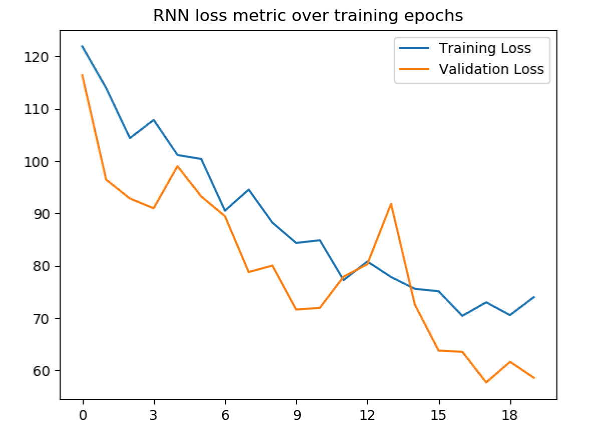

```
Model training summary
_________________________________________________________________
 Best training set loss : 73.02 MAPE
 Best Validation set loss : 57.72 MAPE
 Total Epochs : 20
_________________________________________________________________
```

The figure above shows information from TensorFlow's TensorBoard showing the progression of the loss metric, in this 
case the mean absolute percentage error, over epochs during training. In blue is the loss on the training dataset, in 
orange is the loss on the validation dataset. In this example the network minimised the loss to approximately 57% mean 
absolute percentage error on the validation set after 17 epochs. The network was trained for a maximum of 20 epochs.

The network output against targets for the validation dataset is shown in the figure below.

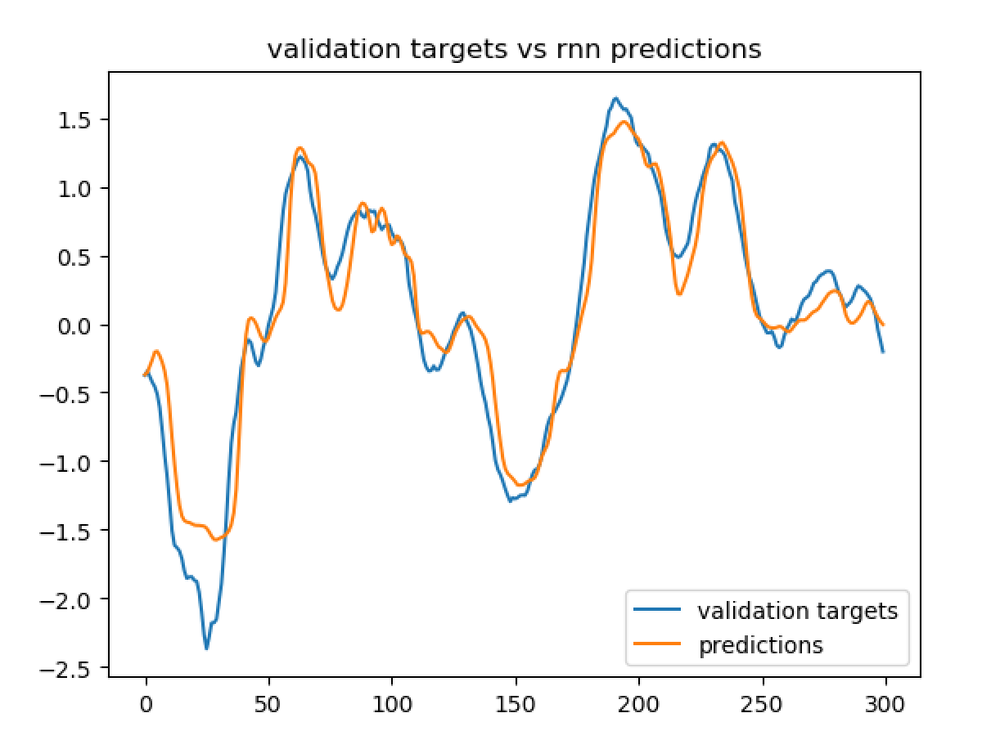

Of the total 4831 validation data-points the first 300 are displayed. This shows the general behavior of the network 
compared against the targets of the validation dataset. This network is still able to generalise well given its 
low complexity and time to train.

<br/>

## Strategy
### Strategy Performance
The strategy was back-tested on the Bitcoin-Tether (BTC-USDT) pair for the first 6 months of 2021, that is from the
beginning of january to the end of june 2021. The performance of the strategy is expressed as the ROI over the 
timeframe. The table below shows the result of the backtest, result of a buy and hold benchmark and the percentage 
change of the value of Bitcoin.

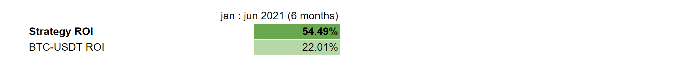

Given a starting cash position of 1000 USD, the portfolio value after 6 months is 1544.94 USD, that is a 54.49% 
ROI. Over the same period, the value of Bitcoin or the BTC-USDT pair performed less well, the percentage change of the 
value of Bitcoin was 22.25%. For comparison, a buy and hold strategy over the same timeframe, yielded a 22.01% ROI, 
that is the percentage change of the value of Bitcoin including commission fees.

Over the 6-month period, the strategy executed 1289 orders of which 747 buy orders and 542 sell 
orders. Buy and sell indicators can be seen in the figure below.

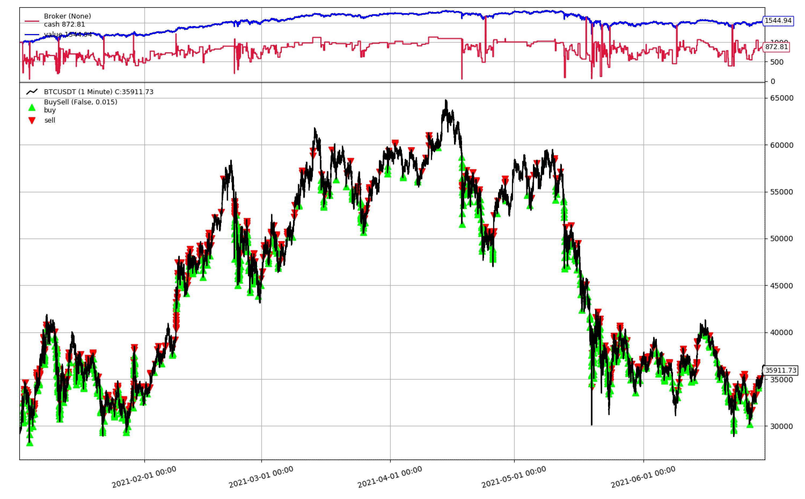

The figure above is an output plot from the Backtrader platform which uses Matplotlib. The top subplot shows the values
of open positions and cash positions during execution of the strategy, in blue is the portfolio value, in red is the
cash position. The middle subplot shows summary of trades, or more importantly when the open position is closed during 
execution of the strategy. The last and main subplot shows the buy and sell indicators on top of the BTC-USDT pair.

Running the strategy on individual months shows that the strategy still outperforms the pair.

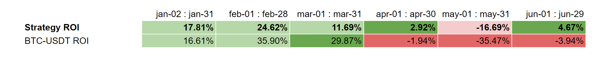

In particular, we notice that that on a negatively performing asset, the strategy still generates profits. For example
over the month of june, Bitcoin value went down by -4% yet the strategy still generated 5% profit.

Drawdown for this strategy is high. Currently, this is being addressed and is further discussed in section 
Strategy Optimisation. The drawdown peaks in the month of May 2021 when BTC prices plummeted by almost 50% in 2 weeks. 

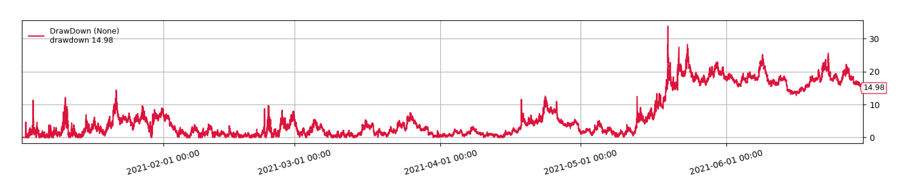

The cumulative return (compounding) per month throughout the 6-month period is given in the table below with cumulative 
number of orders executed.

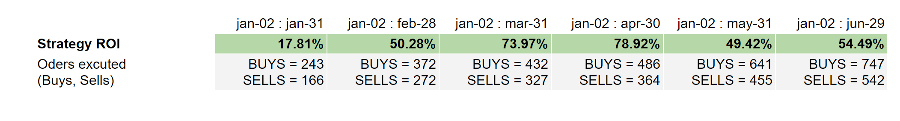

For a total of 1289 orders placed over the 6-month period, the strategy executes on average 7 orders per day. It can be 
noticed that there is a drop in the rate of orders and performance of the strategy over the month of march.
This is also being addressed and is further discussed in section Strategy Optimisation

The Sharpe ratios of the strategy and the benchmark BTC hold strategy are shown in the table below.


Over the 6-month period the strategy gives a sharpe ratio above 2 whereas the benchmark hold strategy gives a sharpe 
ratio inferior to 1. This information is open to interpretation, still the strategy outperforms the benchmark on this 
dataset. For the calculation of the Sharpe ratio a risk-free return of 1% annually (0.5% over 6 months) was used.

### Strategy Execution
The execution of the strategy involves the outputs of the recurrent neural network and other technical indicators.
The flow chart below summarises the order of execution of the RNN and other technical indicators, in particular the role
of the RNN. The complete decision-making process does involve additional steps which are not represented in the flow 
chart.

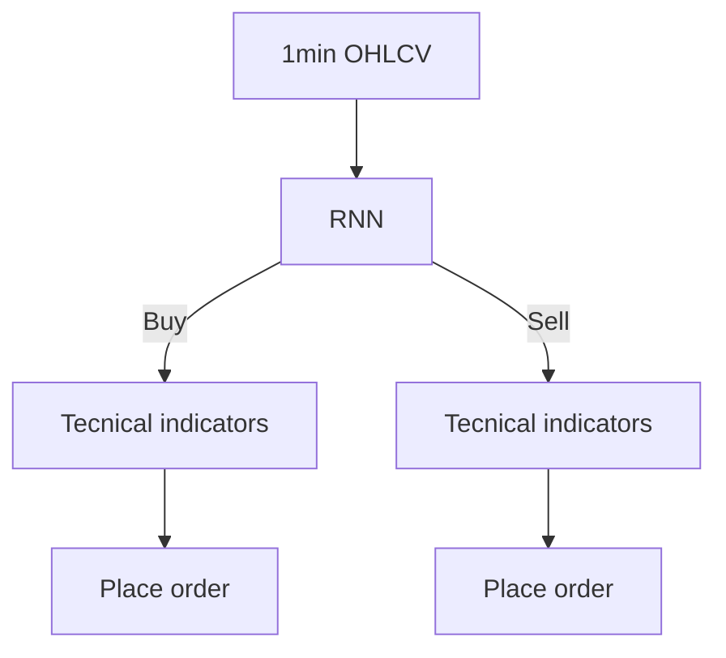

The input of the strategy takes the most recent 1 minute interval Open High Low Close Volume data and preceding data.
For this strategy, at most one order can be placed every minute at market price.

For the RNN, input data is transformed, and it's output un-transformed and used, as explained in previous sections.
Based on the output of the RNN a decision is made, most importantly whether to place a buy order or a sell order.

Following the RNN, technical indicators are used for two main purposes. The first, the confirmation or rejection of
the decision made by the RNN. The second, to assist in the calculations of the size of the order, ie the amount to 
buy or to sell.

In the Backtrader framework this can be achieved in code. The following blocks are source code extracts.
```python
def next():
    ...
    if get_rnn_result() == get_indicators_result() == "Buy":
        buy_quantity = get_buy_quantity()
        ...
    elif get_rnn_result() == get_indicators_result() == "Sell":
        sell_quantity = get_sell_quantity()
        ...
```

The value of `tis_result` is set by different criteria met on several technical indicators. Technical indicators 
used for this strategy in addition to the RNN include fast moving averages, slow moving averages, and rolling 
volatility measures such as standard deviation.
```python
def get_indicators_result():
    if buy_condition_MAs() and buy_condition_SD():
        return "Buy"
    elif sell_condition_MAs() and sell_condition_SD():
        return "Sell"
    ...
```

Buy and sell quantities are also defined by calculations on technical indicators. The results of calculations on 
technical indicators are weighted independently within a weight function. The result of the calculation is then returned 
by the method which takes into account additional metrics such as available cash and the value of the open position. 
```python
def get_buy_quantity():
    ...
    a, b = buy_factor_MAs(), buy_factor_SD()
    c, d = available_cash(), position_values()
    quantity = weight_function(a, b, c, d)
    return quantity
```

Finally, before placing the order a filter is used to test the buy or sell quantities against threshold quantities. 
```python
def next():
    ...
    if buy_quantity > threshold_quantity:
        buy(buy_quantity)
    ...
    if sell_quantity > threshold_quantity:
        sell(sell_quantity)
    ...
```

The threshold quantities set the resolution of the dynamic open position, serve to reduce commissions by blocking 
excessive orders and ensures compliance of order placements with the exchange.

### Strategy Optimisation
Work in progress.

The strategy is profitable on the backtest, however, some key metrics expose flaws in the strategy. Flaws 
include a high drawdown and high variance of the rate of orders executed.

On drawdown, the maximum over the 6-month period is 33.78% which is high. This happened momentarily during the month of 
may when BTC price dropped by over 40% in 1 week. To overcome this flaw, a stop criteria could be added to the strategy
which would automatically close the open position if drawdown exceeds a certain value, for example 20%.

The rate of orders executed is a measure of the number of orders executed during a fixed length of time. Sometimes 
during the 6-month backtest period, the rate of orders executed drops significantly. This can be noticed by the 
sparsely distributed buy and sell indicators in certain months shown in the backtrader plot. For example in april only 
91 orders were executed whereas in june 193 orders were executed. Reasons for this inconsistency include changes in
volatility of BTC price, accuracy of the RNN, miscalculations of the buy or sell quantities.

Applying additional technical indicators, such as the relative strength, may also improve performance.

<br/>

## Contact
Created by [@LiamRichardson](https://www.linkedin.com/in/liam-richardson/)
<br/>
